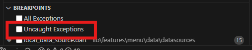

# Flutter Test App

Приложение является шаблоном для клиентской части кроссплатфрменного приложения

# Структура проекта

assets/json/

lib/
 
    app/ - основные файлы приложения, пути и стили

    features/ - фишки проекта 

        menu/ - реализация бокового и нижнего меню

        pages/ - страницы проекта, сейчас реализованы страницы из нижнего меню (там красивые но не функциональные зашлушки)

main.dart - main файл

## Особенности приложения

- на десктопах и планшетах отображается боковое меню

- на мобилках отображается нижнее меню

- боковое меню динамически генерируется из json файла, который либо получается с сервера, либо из файлов проекта(если сервер недоступен)

## Технологии

- **Flutter**: Основной фреймворк для разработки приложения.
- **GoRouter**: Навигация между страницами.
- **Provider**: Управление состоянием приложения.

## Установка и особенности запуска

1. Клонируйте репозиторий

2. Если проект запускается из IDE, приложение виснет при нажатии на кнопку меню, отожмите галочку на Uncaght Exceptions Breakpoints
